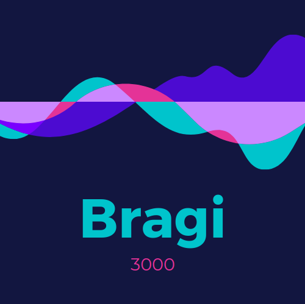

# Bragi 3000

## Folder Structure

This project uses a specific structure to everything has a (semi-)logical place
to be put. This structure contains the following folders:

| Folder            | Description                                                          |
| ----------------- | -------------------------------------------------------------------- |
| `/build`          | Will contain the build output of Bragi 3000 after a production build |
| `/public`         | Contains the base HTML and general assets                            |
| `/src`            | Scripts and required imports, sub-divided into categories            |
| `/src/Assets`     | Assets used by the scripts, such as images, audio, etc.              |
| `/src/Components` | Components with presenter and views grouped together in folders      |
| `/src/Config`     | Configuration files (example files should be copied and filled in)   |
| `/src/Pages`      | Components for each of the pages of the application                  |
| `/src/Services`   | Functions for communicating with services through their API          |
| `/src/Store`      | Scripts relating to the application state (and its persistence)      |
| `/src/Utils`      | Generic utility scripts to be used by other parts of the app         |

Documentation is included inside files to provide more information about their
functionality.

## Commands

The following commands can be run to perform tasks within the project:

| Command         | Description                    |
| --------------- | ------------------------------ |
| `npm run start` | Starts app in development mode |
| `npm run build` | Builds the app for production  |
| `npm run lint`  | Runs ESLint on the project     |
